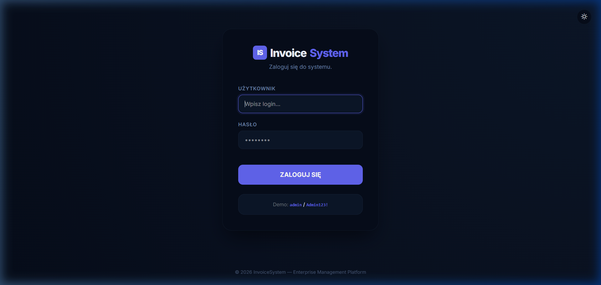
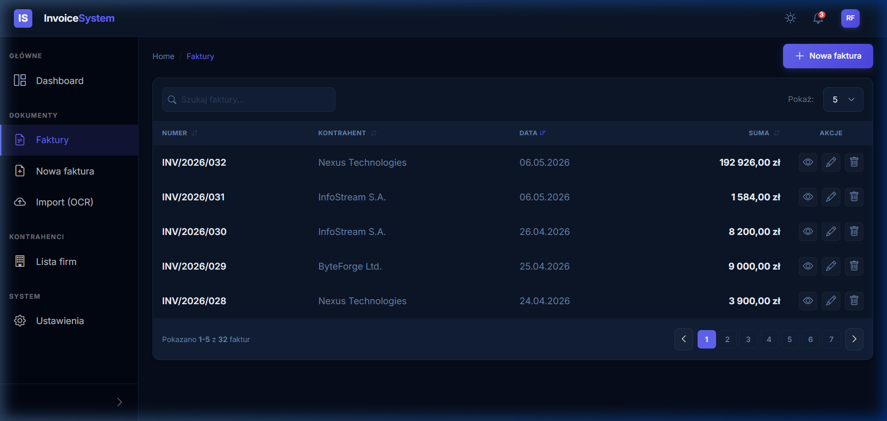
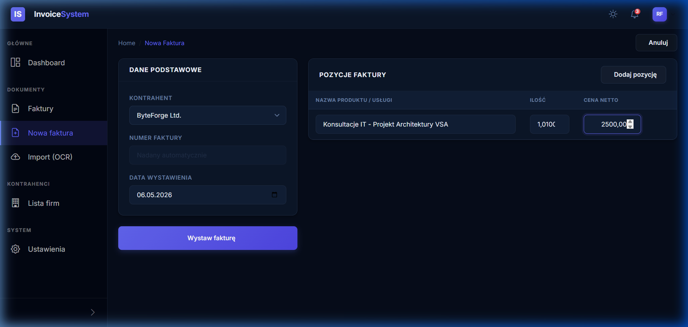
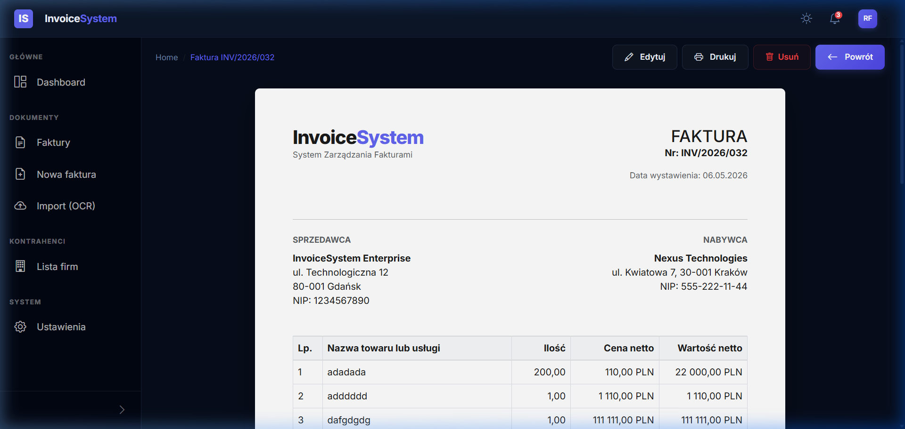

# 🧾 InvoiceSystem — ASP.NET Core 9 Enterprise

Zaawansowany system do kompleksowego zarządzania fakturami, zbudowany w architekturze **Vertical Slice Architecture (VSA)**. Aplikacja stanowi solidny fundament dla systemów klasy ERP/Back-office w ekosystemie .NET 9.

---

<details open>
<summary>🚀 <strong>Demo Wizualne — Jak to wygląda?</strong></summary>
<br>

#### 🔐 System Logowania (Modern Navy Style)
Stylowy, ciemny motyw z autorską walidacją i wysokim kontrastem.


#### 🧾 Lista Faktur (Application Shell)
Nowoczesny układ z bocznym paskiem nawigacji i tabelą danych w stylu Navy.


#### 📝 Wystawianie Faktury (Dynamic Forms)
Intuicyjny proces dodawania pozycji z automatycznym wyliczaniem kwot i walidacją.


#### 📄 Podgląd Faktury (A4 Print Engine)
 Profesjonalny podgląd arkusza A4 z autorskim systemem pozycjonowania stopki.


#### 🌗 System Motywów i UX
Inteligentne przełączanie trybów Dark/Light z pełną synchronizacją komponentów DevExtreme i autorskimi powiadomieniami "dymkowymi".

</details>

---

<details>
<summary>🛠️ <strong>Technologie</strong></summary>
<br>

- **Backend**: .NET 9 (C# 13), MediatR, FluentValidation, Entity Framework Core
- **Database**: SQLite (Development)
- **Frontend**: Razor

### 🎨 Modern UI & Frontend Architecture
Projekt przeszedł gruntowną modernizację warstwy prezentacji, stawiając na lekkość i profesjonalny wygląd:
- **Pure CSS Strategy**: Całkowite odejście od ciężkich bibliotek (DevExpress) na rzecz **Vanilla CSS + BEM + CSS Variables**.
- **A4 Print Engine**: Autorski system generowania dokumentów A4, zapewniający idealne pozycjonowanie stopki i podział stron.
- **Vertical Slice UI**: Style i skrypty są blisko logiki biznesowej, a reużywalne elementy (jak modale) są wydzielone do `Shared/Components`.
- **Navy Design System**: Nowoczesny, ciemny motyw z dbałością o kontrast i typografię (Inter).
</details>

---

<details open>
<summary>⚙️ <strong>Szybki Start</strong></summary>
<br>

**Wymagania:** .NET 9 SDK

1. Sklonuj repozytorium:
```bash
git clone <url>
cd InvoiceSystem
```

2. Uruchom aplikację:
```bash
dotnet run --project InvoiceSystem.Web
```

✅ Aplikacja dostępna pod: **http://localhost:5215**
🔑 Dane logowania: `admin` / `Admin123!`

> **Baza danych:** SQLite (`InvoiceSystem.db`) tworzy się automatycznie przy starcie wraz z danymi testowymi (Seeding).

</details>

---

<details>
<summary>📋 <strong>Status Funkcjonalności</strong></summary>
<br>

| Funkcjonalność | Status | Opis |
| :--- | :---: | :--- |
| **Auth (Identity)** | ✅ | Login, Logout, Globalna ochrona |
| **Lista Faktur** | ✅ | Grid z danymi, filtrowanie |
| **Nowa Faktura** | ✅ | Formularz, dynamiczne pozycje |
| **Detale Faktury** | ✅ | Podgląd dokumentu (Paper Preview) |
| **Eksport PDF** | ⏳ | Planowane |

</details>

---

<details>
<summary>📝 <strong>Zasady Pracy (VSA Workflow)</strong></summary>
<br>

Projekt ściśle przestrzega zasad:
1. **Feature-based folders**: Każdy folder w `Features/` to niezależny moduł (Controller + Handler + View).
2. **Primary Constructors**: Używane wszędzie tam, gdzie to możliwe.
3. **No AutoMapper**: Mapowanie ręczne w handlerach dla pełnej kontroli.
4. **Git Workflow**: 1 feature = 1 commit.

</details>

---
&copy; 2026 InvoiceSystem &mdash; Made with ☕ and .NET
