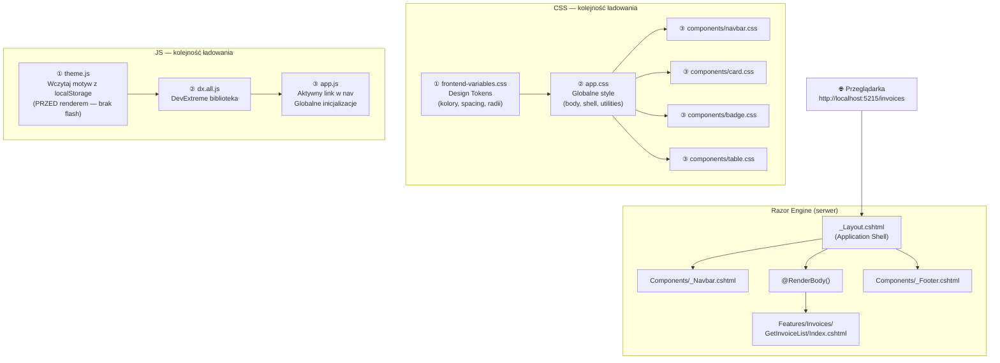
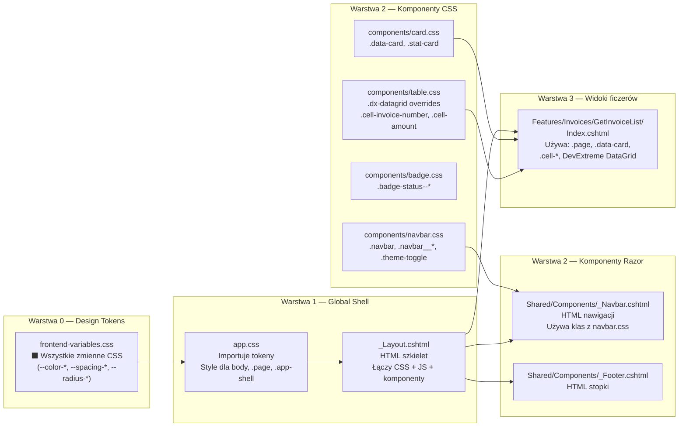

# Frontend Architecture — InvoiceSystem

## Koncepcja: Application Shell + Feature-Based Views

Frontend działa jak **powłoka aplikacji (Application Shell)** — stabilny szkielet który nigdy się nie zmienia, plus zmienne widoki ficzerów wstrzykiwane w `<main>`.

---

## Diagram przepływu ładowania



---

## Hierarchia plików (nadrzędne → podrzędne)



---

## Jak działa przełączanie motywu

```mermaid
sequenceDiagram
    participant U as Użytkownik
    participant BTN as ☀️ Przycisk
    participant JS as theme.js
    participant HTML as &lt;html data-theme&gt;
    participant CSS as frontend-variables.css

    Note over JS: Przy ładowaniu strony
    JS->>JS: localStorage.getItem('invoice-theme')
    JS->>HTML: setAttribute('data-theme', 'dark')
    HTML->>CSS: [data-theme="dark"] aktywny
    CSS-->>U: Ciemne tło, jasny tekst

    Note over U: Klik w przycisk
    U->>BTN: onClick="toggleTheme()"
    BTN->>JS: window.toggleTheme()
    JS->>HTML: setAttribute('data-theme', 'light')
    JS->>JS: localStorage.setItem('invoice-theme', 'light')
    HTML->>CSS: [data-theme="light"] aktywny
    CSS-->>U: Jasne tło (#f3f4f6), ciemny tekst
```

---

## Struktura plików — pełna mapa

```
InvoiceSystem.Web/
│
├── _ViewStart.cshtml          ← Razor: domyślny layout dla wszystkich widoków
├── _ViewImports.cshtml        ← Razor: globalne using + tag helpers
│
├── Shared/
│   ├── _Layout.cshtml         ← APPLICATION SHELL (główny plik HTML)
│   └── Components/
│       ├── _Navbar.cshtml     ← Komponent nawigacji
│       └── _Footer.cshtml     ← Komponent stopki
│
├── Features/
│   └── Invoices/
│       └── GetInvoiceList/
│           └── Index.cshtml   ← Widok ficzera (wstrzykiwany w <main>)
│
└── wwwroot/
    ├── css/
    │   ├── frontend-variables.css  ← [1] Design Tokens (zawsze pierwszy)
    │   ├── app.css                 ← [2] Globalne style + shell
    │   └── components/
    │       ├── navbar.css          ← [3] Style nawigacji
    │       ├── card.css            ← [3] Style kart
    │       ├── badge.css           ← [3] Style statusów
    │       └── table.css           ← [3] Style tabeli + DevExtreme
    └── js/
        ├── theme.js               ← [1] Motyw (MUSI być przed renderem)
        └── app.js                 ← [2] Inicjalizacje UI
```

---

## Co jest nadrzędne, co podrzędne?

| Poziom | Plik | Rola |
|--------|------|------|
| **ROOT** | `frontend-variables.css` | Jedyne źródło prawdy dla kolorów i wartości |
| **SHELL** | `_Layout.cshtml` + `app.css` | Stabilny szkielet — nigdy się nie zmienia |
| **KOMPONENTY** | `_Navbar`, `_Footer`, `*.css` w `components/` | Reużywalne kawałki UI |
| **FEATURE** | `Features/{Moduł}/{Akcja}/Index.cshtml` | Zmieniana zawartość `<main>` per ficzer |

> **Zasada:** każdy nowy ficzer dodaje **tylko nowy widok** w `Features/`. Nigdy nie modyfikuje `_Layout.cshtml` ani plików shell.

---

## Dlaczego `site.css` i `site.js` są w projekcie?

To pozostałości po domyślnym szablonie ASP.NET — są **puste i nieużywane**. Można je usunąć lub zostawić bez wpływu na działanie.
