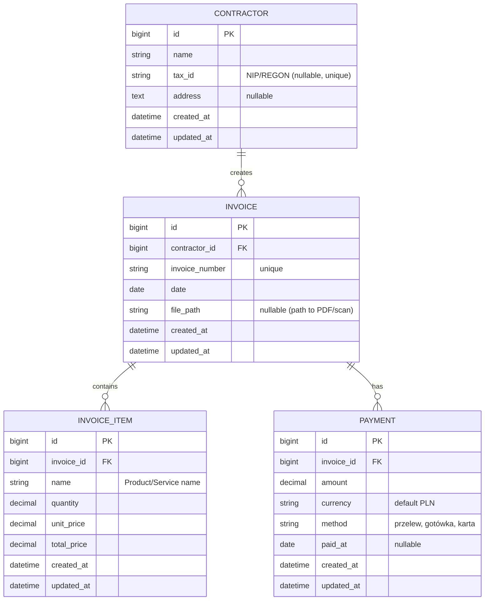

# Specyfikacja Modelu Bazy Danych — InvoiceSystem

Poniżej znajduje się docelowy model bazy danych, który stanowi fundament pod encje domenowe w systemie InvoiceSystem.

## Diagram ERD (Mermaid)

## Szczegóły pól i typów

### 1. Contractors (Kontrahenci)
Reprezentuje wystawcę lub odbiorcę faktury.
- `tax_id`: Kluczowy dla polskich faktur (NIP). Powinien być walidowany.
- `address`: Przechowywany jako tekst, w nowym systemie można rozważyć rozbicie na `Street`, `City`, `ZipCode`.

### 2. Invoices (Faktury)
Główny dokument w systemie.
- `invoice_number`: Unikalny identyfikator biznesowy (np. "FV/2024/04/001").
- `file_path`: Referencja do fizycznego pliku zapisanego na dysku/storagu.

### 3. InvoiceItems (Pozycje na fakturze)
- `total_price`: Kwota wyliczana jako `quantity * unit_price`, zapisywana bezpośrednio dla zachowania historycznej spójności danych finansowych.
- Typy `decimal(15,2)` są poprawne dla operacji finansowych (EF Core zmapuje je na odpowiedni format w SQLite).

### 4. Payments (Płatności)
Model wspiera wiele płatności do jednej faktury (płatności częściowe).
- `method`: Warto rozważyć zamianę na `Enum` (Przelew, Gotówka, Karta).
- `paid_at`: Data faktycznego wpływu środków.

---

## Proponowane usprawnienia dla nowego systemu (InvoiceSystem)

1.  **Value Objects**: Zastosowanie Value Objects dla `Money` (Amount + Currency) oraz `Address`.
2.  **Tax Rate**: Dodanie stopy podatku VAT (`TaxRate`) do pozycji faktury.
3.  **Invoice State**: Wprowadzenie statusu faktury (Draft, Issued, Paid, Overdue, Cancelled).
4.  **Contractor Types**: Rozróżnienie na `Vendor` (Sprzedawca) i `Customer` (Nabywca).
5.  **Audit Trail**: Śledzenie zmian (kto i kiedy zmodyfikował fakturę).
